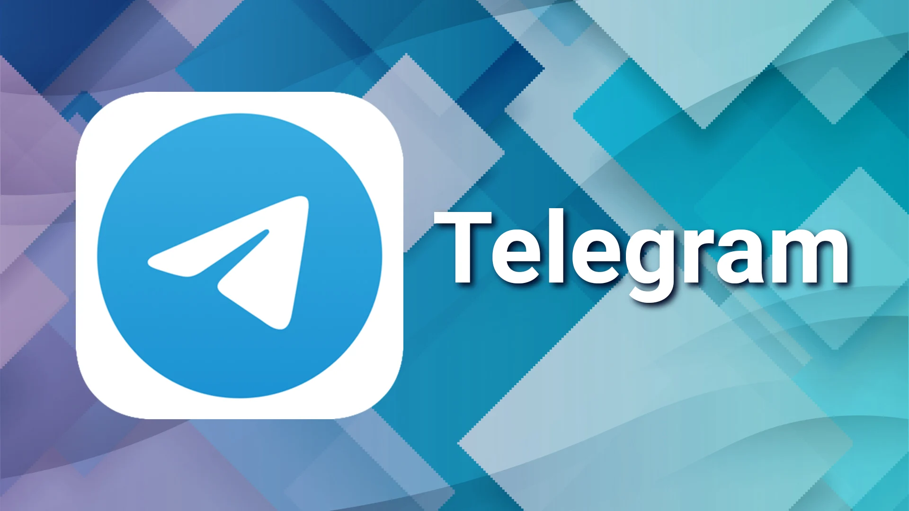

<!-- HEADER START -->
<p>

# TGbot <a href="https://core.telegram.org/bots/api"></a>

</p>
<!-- HEADER END -->

Библиотека Google Apps Script для работы с [API Telegram](https://core.telegram.org/bots/api).<br/>
Получайте удовольствие от работы в GAS с помощью Google Таблиц.

[](https://yoomoney.ru/to/410019620244262)


ID библиотеки:

```bash
1LyGnqsaphk-K_EB8ZxqcBRiKXRE2TY8oSHWlZn4HBje1WlmoNk51wGeg
```

> Поддерживает работу только через Webhook (doPost(e)).

[Пример бота](https://t.me/guf_hub_test_bot)<br/>
[Отправляйте сюда ошибки](https://t.me/nosaev_m)<br/>
Авторский канал [ExceLifeHack](https://zen.yandex.ru/excelifehack)<br/>
Помощь [Google Apps & API. Скрипты, Таблицы, BigQuery, Отчеты, Автоматизация ](https://t.me/googleappsscriptrc)

## Подключение

Откройте редактор скриптов: Расширения -> Apps Script -> Библиотеки.

Заполните поля формы **Добавить библиотеку**:

- вставьте ID библиотеки;
- нажмите **Найти**;
- выберите последнюю версию и нажмите **Добавить**.

## Инициализация бота

```JavaScript
// Токен Telegram-бота от \@BotFather.
const botToken = "<botToken>";

// ссылка на Google WebApp для работы с ответами doGet(e).
const webAppUrl = "Optional[<webAppUrl>]";

// печатаем URL-адрес и OPTIONS запроса при выполнении, по умолчанию false.
const logRequest = "Optional[<logRequest>]";

// PropertiesService.getScriptProperties();
const service = "Optional[<service>]";

// установить parse mode, по умолчанию "HTML".
const parseMode = "Optional[<parseMode>]";

const Bot = TGbot.bot({ botToken, webAppUrl, logRequest, service, parseMode });
// Bot.setParseMode("MarkdownV2"); // установить parse mode, по умолчанию "HTML"
// Bot.setLogRequest(); // если вы не передадите logRequest в качестве аргумента
// Bot.info(); // информация о боте и доступных методах
```

## Использование методов

```JavaScript
const chat_id = "123456" // chat_id получателя

// отправить сообщение
const response = Bot.sendMessage({ chat_id: chat_id, text: "Some text 😁" });

console.log(JSON.stringify(response, null, 7));

const message_id = response?.result?.message_id;

// изменить сообщение
Bot.editMessageText({
  chat_id: chat_id,
  message_id: message_id ,
  text: "Changed message",
});

// удалить сообщение
Bot.deleteMessage({
  chat_id: chat_id,
  message_id: message_id,
});

// отправить фото
Bot.sendPhoto({
    chat_id: chat_id,
    photo: "photo url",
    caption: "caption",
  });

// отправляем группу медиа (фото)
const data = [
  ["photo url", "caption 1"],
  ["photo url", "caption 2"],
  ["photo url", "caption 3"],
].map((item) => TGbot.inputMediaPhoto({ media: item[0], caption: item[1] }));

console.log(JSON.stringify(data, null, 7));
Bot.sendMediaGroup({ chat_id: chat_id, media: data });

// отправляем изображение или документ с помощью Blob
const ss = SpreadsheetApp.getActiveSpreadsheet();
const sheet = ss.getSheetByName("Sheet name");

// пример отправки графика (фото .png) из листа Google Sheets
const blob = sheet.getCharts()[0].getBlob();

Bot.sendPhoto({
  chat_id: chat_id,
  photo: blob,
  contentType: "multipart/form-data" // необходимо указать
});

Bot.sendDocument({
  chat_id: chat_id,
  document: blob,
  contentType: "multipart/form-data" // необходимо указать
});

// отправить архив с данными
// имя файла передавайте только латиницей, для транслитерации используйте TGbot.translit(filename).
const filename = 'Test';
// [blob, ...] Вы можете указать несколько файлов BLOB-объектов (используйте разные имена для BLOB-объектов)
const zip = Utilities.zip([blob], `${filename}.zip`);

Bot.sendDocument({
  chat_id: chat_id,
  document: zip,
  contentType: "multipart/form-data" // необходимо указать
});

// отправляем опросы
// обычный
Bot.sendPoll({
  chat_id: chat_id,
  question: "How's the weekend?",
  options: ["Fantastic", "Will do", "It used to be better"],
});

// quiz
Bot.sendPoll({
  chat_id: chat_id,
  question: "The parrot and the hamster ate oats and nuts.\nThe hamster didn't eat the oats, who ate the nuts?",
  options: ["Parrot", "Hamster", "Nobody"],
  type: "quiz",
  is_anonymous: false,
  correct_option_id: 1, // правильный ответ в массиве, если 0 то не передавать
  explanation: "Interesting riddles for children 10 years old!!!"
});

// прекращаем опрос
Bot.stopPoll({
  chat_id: chat_id,
  message_id: message_id, // Идентификатор сообщения с опросом, который нужно остановить
});

/**
 * Сохранение файла xlsx, отправленного боту Webhook — doPost(e)
 * на Goole Drive (должно быть подключено к проекту Drive API).
 * @param {Message} message полученное сообщение.
 * @param {string} folderId Идентификатор папки, в которой будет сохранен файл.
 * @return {string} идентификатор сохраненного файла.
 */
function saveXlsxFileToDrive(message, folderId) {
  const blob = UrlFetchApp.fetch(
    Bot.getFile(message.document.file_id)
  ).getBlob();
  // const blob = UrlFetchApp.fetch(Bot.getFileDownloadUrl(Bot.getPath(message.document.file_id))).getBlob(); // или так
  const file_name = message.document.file_name.replace(
    `${
      message.document.file_name.split(".")[
        message.document.file_name.split(".").length - 1
      ]
    }.`,
    ""
  );

  const resource = {
    title: file_name,
    mimeType: MimeType.GOOGLE_SHEETS, // если параметр не указан, он будет сохранен в исходном формате
    parents: [{ id: folderId }],
  };

  const file = Drive.Files.insert(resource, blob);
  return file.id;
}
```

## Кнопки клавиатуры

```JavaScript
const Keyboard = TGbot.keyboard();
const Key = TGbot.key();

const keys = ["1", "2", "3", "4"];
const KEYBOARD_REPLY = Keyboard.make([keys, "5"], { columns: 2 }).reply();

Bot.sendMessage({
  chat_id: chat_id,
  text: "Sent the keyboard 👇",
  reply_markup: KEYBOARD_REPLY,
});

const KEYBOARD_INLINE = Keyboard.make(
  [Key.url("✅ Press me", "https://www.google.ru")],
  { columns: 1 }
).inline();

Bot.sendMessage({
  chat_id: chat_id,
  text: "And here is the inline keyboard 👇",
  reply_markup: KEYBOARD_INLINE,
});

Bot.sendMessage({
  chat_id: chat_id,
  text: "Remove keyboard 😎",
  reply_markup: Keyboard.remove(),
});

// встроенный календарь
// создаем календарь
Bot.sendMessage({
  chat_id: chat_id,
  text: `Select date:`,
  reply_markup: TGbot.calendar({ }), // без параметров, текущий месяц
  });

// Callback Inline calendar return
/** @type {CallbackQuery}*/
const callback = contents?.callback_query;

if (callback) {
  const cb_user_id = callback?.from?.id;
  const cb_data = callback?.data;
  const cb_msg = callback?.message;

  if (new Date(cb_data.split(":")[1]) instanceof Date) {
    date = cb_data.split(":")[1];

    if (/DAY/.test(cb_data))
      return Bot.editMessageText({
        message_id: cb_msg.message_id,
        chat_id: cb_user_id,
        text: `Date selected: ${date}`,
       });
    else {
      [year, month, day] = date.split("-");
      return Bot.editMessageReplyMarkup({
        message_id: cb_msg.message_id,
        chat_id: cb_user_id,
        reply_markup: TGbot.calendar({ month, year }), // пагинация <<< >>>
      });
    }
  }
}
```

## Webhook - doPost(e)

```JavaScript
const botToken = "<botToken>"
const webAppUrl = "<webAppUrl>"
const Bot = TGbot.bot({ botToken, webAppUrl });

function doPost(e) {
  if (e?.postData?.contents) {
    // парсим полученный объект
    const contents = JSON.parse(e.postData.contents);
    const debug =
      ss.getSheetByName("Debug") || ss.insertSheet("Debug").setTabColor("RED");
    debug.getRange(1, 1).setValue(JSON.stringify(contents, null, 7));

    if (contents.message) {
      /**
       * Скопируйте критерии из файла Types.js в свой проект.
       * Используйте JSDoc для определения типов запросов, которые
       * открывает возможности для подсказок в онлайн-редакторе.
      */

      /** @type {Message}*/
      const msg = contents.message;
      const text = msg.text;
      const chat_id = msg.from.id;

      if (TGbot.isBotCommandMessage(msg)) {
        if (["/start"].includes(text))
          Bot.sendMessage({ chat_id: chat_id, text: `Hello!` });
        else if (["/myid"].includes(text))
          Bot.replyMessage({
            message: msg,
            text: `Your Telegram ID: ${chat_id}`,
          });
        else if (!["/start", "/myid"].includes(text))
          Bot.answerMessage({
            message: msg,
            text: `I don't know such a command ${text} 😕, try again.`,
          });
      } else if (["photo"].includes(text.toLowerCase())) {
        const data = [
           ["photo url", "caption 1"],
           ["photo url", "caption 2"],
           ["photo url", "caption 3"],
        ].map((item) =>
          TGbot.inputMediaPhoto({ media: item[0], caption: item[1] })
        );

        return Bot.sendMediaGroup({ chat_id: chat_id, media: data });
      } else if (["video"].includes(text.toLowerCase()))
        return Bot.sendVideo({ chat_id: chat_id, video: "video url" });
      else
        return Bot.sendMessage({
          chat_id: chat_id,
          text: `I don't understand ¯\_(ツ)_/¯`,
        });
    }
  }
}
```

## JSDoc:

Добавлен файл Types.js, автор идеи [**Alexander Ivanov**](https://github.com/contributorpw/telegram-bot-api-gas/blob/master/src/TelegramBot/types.js).<br />
Скопируйте содержимое файла Types.js в свой проект.<br/>
После добавления вы можете использовать JSDoc для уточнения типов переменных, что открывает возможности для подсказок в онлайн-редакторе.
<br/>

## Неофициальные методы:

- [getPath](https://github.com/Guf-Hub/TGBot/blob/ba5af6b76ca49d2a28194e0d649df061353062de/1%20Class%20TGBot.js#L1958) метод для получения пути к файлу.
- [getFileDownloadUrl](https://github.com/Guf-Hub/TGBot/blob/ba5af6b76ca49d2a28194e0d649df061353062de/1%20Class%20TGBot.js#L1977) метод получения ссылки для скачивания файла.
- [answerMessage](https://github.com/Guf-Hub/TGBot/blob/ba5af6b76ca49d2a28194e0d649df061353062de/1%20Class%20TGBot.js#L2001) ответ from.id на полученное сообщение. Передайте объект сообщения в качестве первого аргумента.
- [replyMessage](https://github.com/Guf-Hub/TGBot/blob/ba5af6b76ca49d2a28194e0d649df061353062de/1%20Class%20TGBot.js#L2053) ответ message_id на полученное сообщение. Передайте объект сообщения в качестве первого аргумента.

## Copyright & License

[MIT License](LICENSE)

Copyright (©) 2022 by [Mikhail Nosaev](https://github.com/Guf-Hub)
